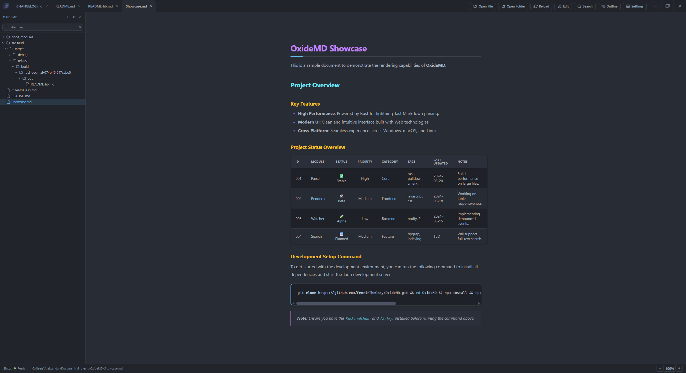

# OxideMD

A lightweight, cross-platform, read-only Markdown viewer written in Rust using [Tauri v2](https://tauri.app/). Runs on Windows, Linux, and macOS. Inspired by [ViewMD](https://github.com/rabfulton/ViewMD).



## Features

- **Full Markdown rendering** — headings, bold, italic, strikethrough, inline code, code blocks, blockquotes, ordered and unordered lists, tables, horizontal rules, links, and local images
- **Syntax highlighting** — powered by [syntect](https://github.com/trishume/syntect) with support for hundreds of languages
- **Tabs** — open multiple files in parallel; each tab has independent scroll and zoom state; reorder tabs with keyboard shortcuts
- **Search** — `Ctrl+F` toggles search with match highlighting, next/previous navigation, match counter, and case-sensitive toggle
- **Theming** — dark, light, and system themes (Atom One Dark / Atom One Light) with configurable accent colors for H1/H2/H3 headings and list bullets
- **Custom fonts** — install `.ttf`/`.otf`/`.woff`/`.woff2` font files from the settings font dropdown; fonts are stored in the OxideMD config folder and persist across sessions
- **Settings** — tabbed settings dialog (Reading / Colors / About) with persistent configuration (font family, font size, line height, reading width, colors, theme) saved per-platform (`%APPDATA%\OxideMD` on Windows, `~/.config/oxidemd` on Linux, `~/Library/Application Support/com.oxidemd.OxideMD` on macOS)
- **Reading layout** — configurable line height (1.0–2.4) and reading width (480–1400 px) that scales with zoom
- **Folder browser** — open a directory to view its contents in a sidebar tree; click files to open them in tabs
- **Live file watching** — opened files and folders are monitored for changes; tabs automatically reload when modified externally
- **Drag and drop** — drag one or more `.md` files onto the window to open them
- **Multi-file open** — select multiple files at once from the open dialog
- **CLI support** — pass a file path as an argument: `oxidemd path/to/file.md`
- **Custom title bar** — frameless window with integrated minimize/maximize/close controls
- **Window geometry** — size and maximized state are restored between sessions
- **Update checker** — check for new releases from the settings panel; prompts to download when an update is available
- **Tiny footprint** — no Electron, no bundled browser; uses the native webview on each platform (WebView2 on Windows, WebKitGTK on Linux, WKWebView on macOS)

## Keyboard Shortcuts

> On macOS, use `Cmd` instead of `Ctrl`.

| Shortcut         | Action                        |
| ---------------- | ----------------------------- |
| `Ctrl+O`         | Open file(s)                  |
| `Ctrl+W`         | Close current tab             |
| `Ctrl+Tab`       | Switch to next tab            |
| `Ctrl+Shift+Tab` | Switch to previous tab        |
| `Ctrl+R`         | Reload current file           |
| `Ctrl+Shift+Left`  | Move tab left                 |
| `Ctrl+Shift+Right` | Move tab right                |
| `Ctrl+F`         | Toggle search                 |
| `Enter`          | Next search match             |
| `Shift+Enter`    | Previous search match         |
| `Esc`            | Close search / close settings |
| `Ctrl++`         | Zoom in                       |
| `Ctrl+-`         | Zoom out                      |
| `Ctrl+0`         | Reset zoom                    |
| `Home`           | Scroll to top                 |

## Building from Source

### Prerequisites

- [Rust](https://rustup.rs/) (stable)

**Windows:**
- MSVC toolchain
- Microsoft C++ Build Tools
- Edge WebView2 (included with Windows 10 1803+ / Windows 11)

**Linux (Debian/Ubuntu):**
```bash
sudo apt install libwebkit2gtk-4.1-dev build-essential curl wget file libxdo-dev libssl-dev libayatana-appindicator3-dev librsvg2-dev
```

**macOS:**
- Xcode Command Line Tools: `xcode-select --install`

### Install Tauri CLI

```powershell
cargo install tauri-cli --version "^2" --locked
```

### Run in development mode

```powershell
cd src-tauri
cargo tauri dev
```

### Build installer

```powershell
cd src-tauri
cargo tauri build
```

Installers are output to `src-tauri/target/release/bundle/`:

| Platform | Formats                      |
| -------- | ---------------------------- |
| Windows  | `.msi`, `.exe` (NSIS)        |
| Linux    | `.deb`, `.rpm`, `.AppImage`   |
| macOS    | `.dmg`                       |

## Project Structure

```
OxideMD/
├── .github/workflows/      # CI/CD (GitHub Actions release workflow)
├── frontend/               # WebView frontend (HTML/CSS/JS)
│   ├── index.html          # App shell: toolbar, search bar, content area, settings modal
│   ├── style.css           # Dark/light/system themes, markdown element styles
│   └── app.js              # All UI logic: rendering, search, settings, shortcuts
├── src-tauri/              # Rust backend (Tauri)
│   ├── src/
│   │   ├── main.rs         # Entry point
│   │   ├── lib.rs          # Tauri app setup, plugin registration, CLI arg handling
│   │   ├── commands.rs     # Tauri IPC commands exposed to the frontend
│   │   ├── markdown.rs     # pulldown-cmark → HTML conversion, local image embedding
│   │   ├── highlight.rs    # Syntax highlighting via syntect
│   │   ├── config.rs       # Settings struct, TOML load/save
│   │   └── util.rs         # HTML escaping helpers
│   ├── icons/              # App icons (all sizes)
│   ├── oxidemd.desktop     # Desktop template for Linux deb/rpm (MIME types, categories)
│   └── tauri.conf.json     # Tauri configuration (window, bundle, file associations)
├── media/                  # Screenshots and assets for documentation
├── CHANGELOG.md            # Version history
└── package.json            # Node dependencies for icon generation (@resvg/resvg-js)
```

## Technology Stack

| Component           | Library                                                            |
| ------------------- | ------------------------------------------------------------------ |
| App framework       | [Tauri v2](https://tauri.app/)                                     |
| Markdown parser     | [pulldown-cmark](https://github.com/raphlinus/pulldown-cmark)      |
| Syntax highlighting | [syntect](https://github.com/trishume/syntect)                     |
| Configuration       | [serde](https://serde.rs/) + [toml](https://crates.io/crates/toml) |
| Config paths        | [directories](https://crates.io/crates/directories)                |

## License

MIT
ttps://serde.rs/) + [toml](https://crates.io/crates/toml) |
| Config paths        | [directories](https://crates.io/crates/directories)                |

## License

MIT
