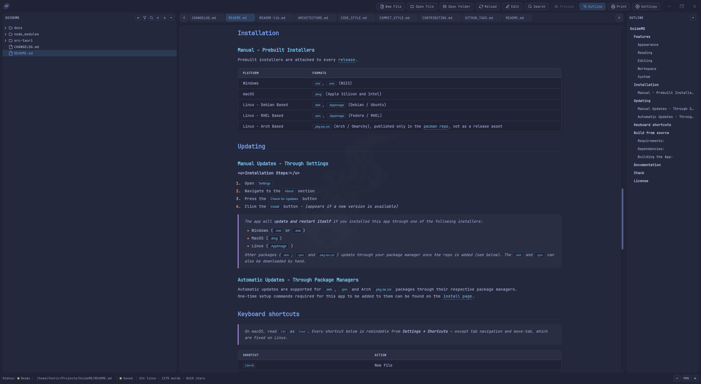

# OxideMD

A fast, native Markdown viewer and editor for Windows, Linux, and macOS.
Written in Rust for Backend and [Tauri](https://tauri.app/) for Frontend.



OxideMD reads, renders, and edits Markdown without bundling a browser.
It draws into your platform's own webview:

  - WebView2 on Windows
  - WebKitGTK on Linux
  - WKWebView on macOS

It launches in well under a second and stays light on disk and memory.
Drop a `.md` file on the window, press `Ctrl+E` to edit, `Ctrl+S` to save.

## Features

### Appearance

- Fully Customizable Application Themes (*All colors*)
- Built-in themes (10):
  - Atom One Dark
  - Atom One Light
  - Catppuccin Mocha
  - Dracula
  - Gruvbox Dark
  - Nord
  - Rosé Pine
  - Solarized Light
  - Tokyo Night
  - Tokyo Night Storm
- Theme Importing and Exporting using `.json` files

- Built-in Fonts (6):
  - System Default
  - Georgia
  - Consolas
  - Arial
  - Verdana
  - Times New Roman
- Custom Fonts — Import `.ttf`, `.otf`, `.woff`, or `.woff2` fonts via settings
- A custom frameless window with integrated controls and full edge and corner resizing

### Reading

- Syntax highlighting for hundreds of languages
- Fully rendered:
  - Images
  - Fenced code
  - Tables
  - Headings
  - Task lists
  - Blockquotes
  - Footnotes
- In-document search with highlighting, match navigation, and a case-sensitivity toggle
- Print to PDF through the OS print dialog — light-on-white for legibility, or matched to your theme
- Adjustable reading width (480–1400 px) and line height
- Configurable "preserve line breaks" mode

### Editing

- A full text editor with Markdown-aware highlighting, toggled per tab
- Split view with a draggable divider and synchronized scrolling
- A formatting toolbar and rebindable shortcuts for bold, italic, strikethrough, inline code, headings, lists, links, images, and indentation
- Smart Enter that continues lists and blockquotes, and exits the block on a second press
- Themed find-and-replace inside the editor
- Per-file draft autosave with a recovery prompt — and a conflict warning if the file changed on disk

### Workspace

- Tabs with independent scroll, zoom, and split-view state, reorderable by keyboard
- A folder sidebar with name filtering, expand/collapse-all, and live file watching that reloads externally edited tabs
- Project-wide content search across every Markdown file under the open folder
- A document outline popover for jumping between headings
- Right-click context menus on the tab strip and the folder tree
- Drag and drop `.md` files onto the window to open them; drop an image into the editor to insert it
- A responsive layout: on narrow windows the sidebars become overlay drawers and the toolbar folds its overflow into a "⋯" menu, so the app stays usable down to its minimum size

### System

- Fully customizable **Keyboard Shortcuts** with conflict detection
- Built-in Application Updater
- CLI Support - `oxidemd path/to/file.md` opens files at launch; `oxidemd --reset-all --yes` wipes all state for a clean recovery
- Error Logging
- Config files stored per platform:
  - Windows: `%APPDATA%\oxidemd\OxideMD\config`
  - Linux: `~/.config/oxidemd`
  - MacOS: `~/Library/Application Support/com.oxidemd.OxideMD`

## Installation

### Manual - Prebuilt Installers

Prebuilt installers are attached to every [release](https://github.com/FenrirTheGray/OxideMD/releases).

| Platform             | Formats                                                 |
| -------------------- | ------------------------------------------------------- |
| Windows              | `.msi`, `.exe` (NSIS)                                   |
| macOS                | `.dmg` (Apple Silicon and Intel)                        |
| Linux - Debian Based | `.deb`, `.AppImage` (Debian / Ubuntu)                   |
| Linux - RHEL Based   | `.rpm`, `.AppImage` (Fedora / RHEL)                     |
| Linux - Arch Based   | `.pkg.tar.zst` (Arch / Omarchy / EndeavourOS / Manjaro) |

## Updating

### Manual Updates - Through Settings

**<u>Installation Steps:</u>**

1. Open `Settings`
2. Navigate to the `About` section
3. Press the `Check for Updates` button
4. Click the `Install` button *- (appears if a new version is available)*

> The app  will **update and restart itself** if you installed this app through one of the following installers:
> - Windows (`.msi` or `.exe`)
> - MacOS (`.dmg`)
> - Linux (`.AppImage` )
>
> Other packages (`.deb`, `.rpm` and `.pkg.tar.zst`) require manual download and installation.

### Automatic Updates - Through Package Managers
Automatic updates are supported for `.deb` and `.rpm` packages through their respective package managers.
One-time setup commands required for this app to be added to them can be found on the [install page](https://fenrirthegray.github.io/OxideMD/).

## Keyboard shortcuts

> On macOS, read `Ctrl` as `Cmd`. Every shortcut below is rebindable from **Settings → Shortcuts** — except tab navigation and move-tab, which are fixed on Linux.

| Shortcut                      | Action                           |
| ----------------------------- | -------------------------------- |
| `Ctrl+N`                      | New file                         |
| `Ctrl+O`                      | Open file(s)                     |
| `Ctrl+S`                      | Save                             |
| `Ctrl+W`                      | Close tab                        |
| `Ctrl+E`                      | Toggle edit mode                 |
| `Ctrl+F`                      | Search / find                    |
| `Ctrl+P`                      | Print to PDF                     |
| `Ctrl+R`                      | Reload file                      |
| `Ctrl+Tab` / `Ctrl+Shift+Tab` | Next / previous tab              |
| `Ctrl+Shift+←` / `→`          | Move tab                         |
| `Ctrl++` / `-` / `0`          | Zoom in / out / reset            |
| `Ctrl+B` / `I` / `K`          | Bold / italic / link (edit mode) |
| `Enter` / `Shift+Enter`       | Next / previous search match     |
| `Esc`                         | Close search or settings         |

## Build from source

### Requirements:
- Rust: [https://rustup.rs/](https://rustup.rs/)
- NodeJS: [https://nodejs.org/](https://nodejs.org/)

### Dependencies:
- Linux (Debian/Ubuntu):
  ```bash
  sudo apt install libwebkit2gtk-4.1-dev build-essential curl wget file libxdo-dev \
      libssl-dev libayatana-appindicator3-dev librsvg2-dev
  ```

- Linux (Arch):
  ```bash
  sudo pacman -S --needed webkit2gtk-4.1 base-devel curl wget file openssl librsvg
  ```
- Windows:
  - MSVC toolchain and Microsoft C++ Build Tools
  - WebView2 (ships with Windows 10 1803+ and Windows 11)

- macOS:
  ```
  xcode-select --install
  ```
### Building the App:
Install cargo and start the dev server:
  ```bash
  cargo install tauri-cli --version "^2" --locked
  npm install
  cargo tauri dev          # dev run; auto-builds the frontend via esbuild
  ```

Before committing, run the frontend checks — `esbuild` strips TypeScript types but never checks them, so `tsc` is the safety net:

```bash
npm run typecheck        # type-check the frontend
npm test                 # run the frontend unit tests
```

Produce installers with:

```bash
cargo tauri build        # outputs to src-tauri/target/release/bundle/
```

> On Arch-based systems, building the AppImage needs `NO_STRIP=true cargo tauri build` — the bundled `linuxdeploy` can't strip Arch's modern `.relr.dyn` ELF sections. The `.deb` and `.rpm` targets are unaffected. For a native Arch package, see [`packaging/aur/`](packaging/aur/README.md).

## Documentation

Deeper documentation lives in [`docs/`](docs/README.md):

- [Architecture](docs/ARCHITECTURE.md) — how the Rust backend and TypeScript frontend split work and talk over IPC
- [Contributing](docs/CONTRIBUTING.md) — dev setup and the pull-request workflow
- [Code Style](docs/CODE_STYLE.md) — Rust and TypeScript conventions
- [Commit Style](docs/COMMIT_STYLE.md) — how to write commit messages
- [GitHub Tags & Releases](docs/GITHUB_TAGS.md) — versioning and the release process

## Stack

[Tauri v2](https://tauri.app/) · [CodeMirror 6](https://codemirror.net/) · [pulldown-cmark](https://github.com/raphlinus/pulldown-cmark) · [syntect](https://github.com/trishume/syntect) · [esbuild](https://esbuild.github.io/)

## License

MIT
